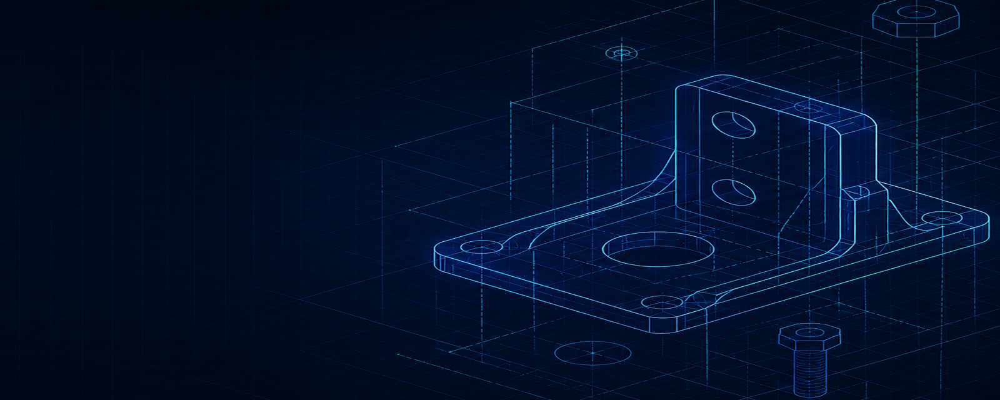

<p align="center">
  
</p>

<h1 align="center">SW Copilot</h1>

<p align="center">
  <strong>Open-source SolidWorks AI automation assistant</strong><br/>
  <em>Talk to your CAD. Ship geometry, not boilerplate.</em>
</p>

<p align="center">
  <a href="#quick-start">Quick Start</a> ·
  <a href="docs/USER-GUIDE.md">User Guide</a> ·
  <a href="docs/ARCHITECTURE.md">Architecture</a> ·
  <a href="docs/CONTRIBUTING.md">Contributing</a> ·
  <a href="CHANGELOG.md">Changelog</a>
</p>

<p align="center">
  
  
  
  
  
  
  
</p>

---

## Why SW Copilot?

Existing CAD AI tools lock you into one provider at $16–417/month and ship closed-source models you can't audit. **SW Copilot flips both defaults**: pick any AI backend (Claude, GPT-4o, DeepSeek, Qwen, MiniMax, Ollama local) and run open source you can read, fork, and extend.

| | Closed-source CAD AI | **SW Copilot** |
|---|---|---|
| AI backend | Single provider, per-tier pricing | **Any OpenAI- or Anthropic-compatible endpoint** |
| Price | $16–417 / month | **Free** (you pay your own API costs) |
| Source code | Closed | **Apache-2.0, open source** |
| COM bridge | Native `winax` module | **Python `pywin32` via stdio JSON-RPC** |
| Tools | Fixed catalog | **26+ tools, plus an extension API** |

---

## Features

- **Natural language → SolidWorks operations.** Describe what you want in English or Chinese. The agent plans the steps, calls tools, and reports structured results — not just a wall of text.
- **Provider-agnostic LLM.** Anthropic protocol + OpenAI-compatible protocol. Anthropic Claude, OpenAI, DeepSeek, Qwen (DashScope), MiniMax, SiliconFlow, Ollama, and any custom endpoint.
- **Python sidecar architecture.** A long-running `sw_agent` process holds the SolidWorks COM connection open, executes tools, and streams structured JSON results back over stdio. No more per-action subprocess thrash.
- **Vision-aware (optional).** Configure an independent vision model (image-to-text) or enable a multimodal main model. The agent can rotate the viewport, capture, analyze, and decide.
- **26+ built-in tools** covering sketch, feature, assembly, reference geometry, document, view, and export. Each tool is a self-describing `@tool`-decorated Python function with an auto-generated JSON schema.
- **Safety first.** Script sanitization, per-session backup with one-click restore, user confirmation gate for destructive operations, and crash log rotation.
- **Developer friendly.** 167 unit tests, end-to-end build (typecheck + lint + test + electron-builder), and a `SKIP_SW_CONNECT` flag for UI-only iteration without SolidWorks installed.

---

## Quick Start

### Prerequisites

- **Windows 10/11 (64-bit)**
- **SolidWorks 2017+** (must be installed and runnable)
- **Python 3.9+** with `pywin32` and `Pillow`:

  ```powershell
  pip install pywin32 pillow
  ```

  The Pillow dependency is important — without it, the sidecar falls back to BMP captures and many vision models refuse to decode them.

- **Node.js 20+** (only required for building from source)

### Install (end users)

1. Download the latest `SW Copilot-Setup-x.y.z-x64.exe` from [Releases](https://github.com/raylanlin/sw-copilot/releases).
2. Double-click to install. The installer places the app and the bundled Python sidecar in `Program Files\SW Copilot\`.
3. Launch SolidWorks, then launch SW Copilot.
4. Open ⚙️ Settings → choose your AI provider → paste your API key → Save.

### Run from source

```bash
git clone https://github.com/raylanlin/sw-copilot.git
cd sw-copilot
npm install
npm run dev
```

> For UI-only iteration without SolidWorks running: `SKIP_SW_CONNECT=true npm run dev`

### First conversation

Open the chat panel and try:

```
Draw a 50×30 mm rectangle on the Front Plane and extrude it 20 mm.
```

```
What is the mass and bounding box of this part?
```

The agent will call `start_sketch` → `sketch_rectangle` → `extrude` in turn and stream each step into the UI. Switch documents in SolidWorks and the sidebar indicator updates within 3 seconds.

---

## Architecture

SW Copilot uses a three-tier architecture. The Python sidecar is the single source of truth for tools; the main process is the orchestrator; the renderer is the surface.

```
┌────────────────────────────────────────────────────────────┐
│  Renderer (React)                                           │
│    └─ llm:agent → window.api.llm.agent(config, messages)    │
└────────────────────────┬───────────────────────────────────┘
                         │ IPC (preload)
┌────────────────────────▼───────────────────────────────────┐
│  Main (Electron)                                            │
│    ├─ runSidecarAgent ─ OpenAI-compatible tool dispatch    │
│    │     ├─ Tools source = sidecar list_tools() (self-describing JSON schema)
│    │     ├─ Execution = sidecar call() → structured {ok, data, error}
│    │     └─ Vision analyze_view → independent vision model OR main model multimodal
│    ├─ Confirmation gate → user approves destructive tools
│    ├─ Per-session backup → one-click rollback
│    └─ Fallback: runAgentLoop (legacy VBS) if sidecar not available
└────────────────────────┬───────────────────────────────────┘
                         │ stdio JSON-RPC (newline-delimited)
┌────────────────────────▼───────────────────────────────────┐
│  Python sidecar (sw_agent, long-running)                    │
│    ├─ win32com → SolidWorks (one persistent connection)    │
│    ├─ Tool registry (@tool decorator) — view/sketch/feature/
│    │   reference/assembly/query/document/export
│    └─ Returns structured JSON for every tool call          │
└────────────────────────────────────────────────────────────┘
```

### Why a Python sidecar?

The legacy design spawned a fresh `cscript.exe` per tool call. That worked but: (a) it paid the COM handshake cost on every step, (b) any uncaught error in the generated VBS left the process in an indeterminate state, and (c) VBS has no first-class way to return structured data — the agent only saw raw `MsgBox` strings.

The P3 sidecar replaces that with a long-running Python process that:

1. Holds one `SldWorks.Application` COM handle for the lifetime of the app.
2. Exposes each tool as a `@tool`-decorated function with auto-generated JSON schema.
3. Returns `{ ok, data, error }` for every call so the agent can self-correct on failure.
4. Streams progress over stdio so the UI can render each step live.

If `pywin32` or Python is missing, the app automatically falls back to the legacy VBS path — nothing crashes, but you lose structured returns and vision. The README will yell at you on first launch.

---

## Requirements

| Layer | Requirement |
|---|---|
| OS | Windows 10 / 11 (64-bit) |
| CAD | SolidWorks 2017 or newer (must be installed and licensed) |
| Python | 3.9+ with `pywin32` and `Pillow` |
| RAM | 4 GB minimum, 8 GB recommended for vision workflows |
| Node | 20+ (only for building from source) |
| Network | Outbound HTTPS to your chosen LLM endpoint |

---

## Documentation

| Doc | Description |
|---|---|
| [User Guide](docs/USER-GUIDE.md) | Install, configuration, usage, FAQ |
| [Architecture](docs/ARCHITECTURE.md) | System design, module breakdown, data flow |
| [API Reference](docs/API-REFERENCE.md) | LLM endpoints, tool catalog, COM API cheat sheet |
| [Development Guide](docs/DEVELOPMENT.md) | Code structure, dev conventions, testing |
| [Contributing](docs/CONTRIBUTING.md) | How to contribute, code style, PR process |
| [Verify Tracker](docs/VERIFY-ISSUES.md) | Tools pending SolidWorks macro-recorder validation |
| [Changelog](CHANGELOG.md) | Version history |
| [Security Policy](SECURITY.md) | Security practices and vulnerability reporting |

中文版文档请见 [README.zh-CN.md](README.zh-CN.md)。

---

## Contributing

We welcome contributions. See [CONTRIBUTING.md](docs/CONTRIBUTING.md).

Particularly welcome:

- 🧪 **SolidWorks real-environment testing reports** — open an issue with your SW version and a minimal repro
- 🔨 **New tool implementations** in `sidecar/sw_agent/tools/` — extend the catalog from 26 → 40+
- 🎨 **UI/UX improvements** to the chat surface and tool step rendering
- 🌐 **Multi-CAD adapters** (Inventor, CATIA, NX, Onshape)
- 📝 **Documentation and translations** — README.zh-CN.md needs continuous updates
- 🔌 **MCP server integration** so SW Copilot can be driven from Claude Code / Cursor

### Adding a new tool

The sidecar's tool registry is the extension point. Add a new file under `sidecar/sw_agent/tools/`:

```python
from ..registry import tool

@tool(
    name="my_tool",
    description="What this tool does (visible to the LLM).",
    parameters={
        "type": "object",
        "properties": {
            "param1": {"type": "string", "description": "First parameter"},
        },
        "required": ["param1"],
    },
)
def my_tool(param1: str) -> dict:
    """Implementation goes here. Return {"ok": True, "data": {...}}."""
    return {"ok": True, "data": {"result": param1}}
```

Restart the app — the sidecar will auto-discover the new tool and surface it to the LLM. See [ARCHITECTURE.md](docs/ARCHITECTURE.md) for the full registry protocol.

---

## Roadmap

- [x] **v0.1.0** — MVP (Electron + LLM + COM + 26 tools)
- [x] **v0.2.0** — Stability (bug fixes + CI/CD + .env fallback)
- [x] **v0.2.1** — Defeat the "silent success" footgun (remove CreateObject fallback)
- [x] **v0.2.2** — Renderer hardening (IPC error normalization + theme tokens)
- [x] **v0.2.3** — CI quality gate on every PR and push
- [x] **v0.2.4** — **Python sidecar architecture (P3)** — structured tool returns, vision pipeline, agent loop rewrite
- [ ] **v0.3.0** — Make sidecar required at install time (drop VBS fallback), validate all `# VERIFY` tools against real SolidWorks versions
- [ ] **v0.4.0** — MCP server adapter (drive SW Copilot from Claude Code / Cursor)
- [ ] **v1.0.0** — Multi-CAD adapters (Inventor, CATIA, NX, Onshape), commercial license track

---

## License

[Apache License 2.0](LICENSE) — permissive open source. Use it, fork it, ship it in a commercial product. Attribution appreciated, not required. Patent grant included. No copyleft.

---

## Acknowledgments

- SolidWorks COM API reference: [CodeStack](https://www.codestack.net/) SolidWorks API documentation
- MCP ecosystem: [SolidworksMCP-TS](https://github.com/vespo92/SolidworksMCP-TS), [SolidPilot](https://github.com/eyfel/mcp-server-solidworks)
- Inspiration: Cursor, Claude Code, MecAgent, and every engineer who has ever hand-written a FeatureExtrusion3 call