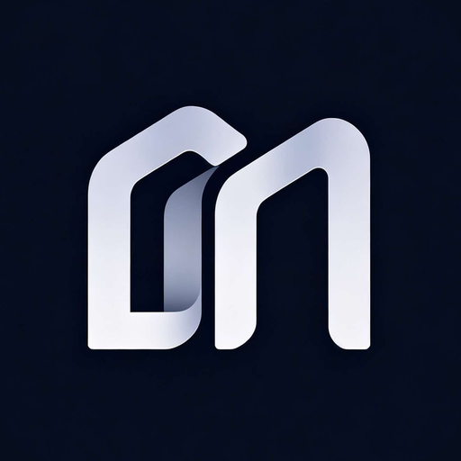

<p align="center">
  
</p>

<p align="center">
  
</p>

<h1 align="center">Millwright</h1>

<p align="center">
  <strong>开源的 SolidWorks AI 机械技工 —— 用自然语言驱动你的 CAD。</strong>
</p>

<p align="center">
  <a href="#快速开始">快速开始</a> ·
  <a href="#工作原理">工作原理</a> ·
  <a href="#支持的-ai-服务商">AI 服务商</a> ·
  <a href="docs/ARCHITECTURE.md">技术架构</a> ·
  <a href="docs/CONTRIBUTING.md">参与贡献</a> ·
  <a href="README.md">English</a>
</p>

<p align="center">
  
  
  
  
  
  
  
</p>

---

用大白话描述你的需求 —— *「在前视基准面画一个 50×30 的矩形，拉伸 20mm」* —— Millwright 就会驱动 SolidWorks 完成。AI 会规划任务、一步步调用真实的建模工具、读取结构化的执行结果，并在出错时自我纠正。

**AI 后端由你决定。** Claude、GPT-4o、DeepSeek、Kimi、MiniMax、Qwen，或本地 Ollama —— 任何支持 Anthropic 或 OpenAI 兼容协议的模型都行。代码开源，你只付自己的 API 费用。

> 市面上的 CAD AI 工具绑定单一服务商、按月收 \$16–417。Millwright 免费且不锁定服务商。

| | 常见 CAD AI SaaS | **Millwright** |
|---|---|---|
| AI 后端 | 按套餐固定 | **任你选择** |
| 价格 | \$16–417 / 月 | **免费**（自带 API Key） |
| 源代码 | 闭源 | **开源（Apache-2.0）** |
| 自动化方式 | 提示词 → 一次性脚本 | **可自我纠正的 agent 工具循环** |
| 视觉反馈 | — | **截取视口并进行视觉推理** |

## 核心特性

- **自然语言 → 真实建模。** 中英文皆可；草图、特征、装配、导出全覆盖。
- **Agent 工具循环。** 模型调用结构化的单一职责工具（`create_sketch`、`extrude`、`chamfer`、`mass_properties`……），拿到 JSON 结果，串联多步完成任务，出错能自愈，而不是静默失败。
- **原生 Function Calling。** 工具通过标准 `tools` 接口注入模型，而非塞进提示词。单一真源 —— 工具自我描述。
- **视觉理解。** agent 可翻转、旋转、截屏，再做分析 —— 既支持**独立视觉模型**（图生文），也支持把图像直接喂给**多模态主模型**。
- **常驻执行引擎。** 常驻 Python 边车通过 `pywin32` 直接驱动 SolidWorks COM API，跨多步复用同一连接。
- **安全第一。** 分语言脚本校验 + 执行前自动备份 + 破坏性操作前用户确认门。
- **开发者友好。** 167 个单元测试、类型化 IPC 边界、`SKIP_SW_CONNECT` 纯 UI 开发模式（无需 SolidWorks）。

## 快速开始

### 安装

1. 从 [Releases](https://github.com/raylanlin/millwright/releases) 下载安装包并运行。
2. 安装边车运行时（用于驱动 SolidWorks）：
   ```bash
   pip install pywin32 pillow
   ```
   > 未装 Python 时应用仍可运行，会自动回退到旧的 VBScript 引擎 —— 但会失去结构化结果与视觉理解。强烈建议安装 Python。

### 从源码运行

```bash
git clone https://github.com/raylanlin/millwright.git
cd millwright
npm install
npm run dev
```

> 纯 UI 开发无需 SolidWorks：设置 `SKIP_SW_CONNECT=true`。

### 配置

1. 先启动 SolidWorks，再启动 Millwright。
2. 打开 ⚙️ **设置** → 选择协议 → 填入 Base URL、API Key、模型名 → **保存**。
3. （可选）开启**视觉**：勾选「主模型支持图像」，或单独配置一个视觉模型。

## 支持的 AI 服务商

| 服务商 | 协议 | Base URL | 推荐模型 |
|---|---|---|---|
| DeepSeek | OpenAI 兼容 | `https://api.deepseek.com` | `deepseek-v4-pro` |
| Kimi / 月之暗面 | OpenAI 兼容 | `https://api.moonshot.cn/v1` | `kimi-k3` |
| MiniMax | OpenAI 兼容 | `https://api.minimaxi.com/v1` | `minimax-m3` |
| Anthropic | Anthropic | `https://api.anthropic.com` | `claude-sonnet-4` |
| OpenAI | OpenAI | `https://api.openai.com/v1` | `gpt-4o` |
| 阿里百炼 (Qwen) | OpenAI 兼容 | `https://dashscope.aliyuncs.com/compatible-mode/v1` | `qwen-max` |
| 硅基流动 | OpenAI 兼容 | `https://api.siliconflow.cn/v1` | — |
| Ollama（本地） | OpenAI 兼容 | `http://localhost:11434/v1` | — |

> Agent 工具调用需要模型支持 function calling。DeepSeek、Kimi K3、MiniMax M3 是一等公民。

## 使用示例

```
你: 在前视基准面画一个 50×30 的矩形，拉伸 20mm
AI: create_sketch(front) → sketch_rectangle(50,30) → extrude(20)  ✓  零件已创建

你: 这个零件多重？包络多大？
AI: mass_properties → bounding_box  ✓  0.42 kg · 50 × 30 × 20 mm

你: 从等轴测看看，比例协调吗？
AI: set_view_orientation(isometric) → analyze_view("比例是否协调？")  ✓

你: 把模型里所有圆角改成 3mm
AI: fillet_all(3)  → 确认？ → ✓  更新了 6 个圆角
```

## 工作原理

```
渲染层 (React UI)
      │  IPC
主进程 (Electron / Node)
      │  agent 循环  ──  原生 function-calling 工具注入模型
      │      ├─ 工具来源与执行 = 边车（结构化 JSON 出入）
      │      └─ analyze_view ─┬─ 独立视觉模型（图生文）
      │                       └─ 或多模态主模型（图像直喂）
      │  stdio 上的 JSON-RPC
Python 边车（常驻）  ──  pywin32 → SolidWorks COM API
      │
SolidWorks
```

- **结构化、可观测的工具。** 每个工具返回 `{ ok, data | error }` JSON，模型能读到真实状态（特征树、尺寸、质量、干涉）来规划下一步。
- **保留旧路径。** Python 边车无法启动时，自动回退原 VBScript 引擎，绝不硬崩。
- **LLM 访问零 SDK 依赖**：原生 `fetch` + 手写 SSE 解析。

详见 [docs/ARCHITECTURE.md](docs/ARCHITECTURE.md)。

## 系统要求

- Windows 10/11 (64-bit)
- SolidWorks 2017+
- Python 3.9+（含 `pywin32`、`pillow`，供边车使用）
- Node.js 20+（仅开发模式）

## 文档

| 文档 | 内容 |
|---|---|
| [技术架构](docs/ARCHITECTURE.md) | 系统设计、模块、数据流 |
| [用户手册](docs/USER-GUIDE.md) | 安装、配置、FAQ |
| [开发者指南](docs/DEVELOPMENT.md) | 代码结构、约定、测试 |
| [API 参考](docs/API-REFERENCE.md) | LLM 接口、工具清单 |
| [贡献指南](docs/CONTRIBUTING.md) | 如何参与 |
| [待核验清单](docs/VERIFY-ISSUES.md) | 待宏录制器核验的多参 API |
| [变更记录](CHANGELOG.md) | 版本历史 |
| [安全策略](SECURITY.md) | 安全规范与漏洞报告 |

## 参与贡献

欢迎贡献 —— 详见 [CONTRIBUTING.md](docs/CONTRIBUTING.md)。我们尤其欢迎：

- 🧪 真实 SolidWorks 环境的测试报告（以及对[待核验 API](docs/VERIFY-ISSUES.md) 的宏录制器核对）
- 🔨 新的边车工具（`sidecar/sw_agent/tools/`）
- 🎨 UI/UX 改进
- 🌐 其他 CAD 适配（Inventor、CATIA、NX）与 MCP server 集成
- 📝 文档与翻译

## 路线图

- [x] **v0.1** — MVP（Electron + LLM + COM + 工具）
- [x] **v0.2** — 稳定基座、CI、文档
- [x] **v0.2.4** — Python 边车、agent 工具循环、视觉理解、Apache-2.0 开源 ← *当前*
- [ ] **v0.3** — 工具全覆盖、宏核验参数、流式工具调用
- [ ] **v1.0** — MCP server、多 CAD 支持

## 关于名字

**Millwright**（名词）—— 安装、维护并操作机械设备的技工。这正是本工具扮演的角色：站在你 SolidWorks 工作台前的 AI 机械技工。

## 许可证

[Apache-2.0](LICENSE) —— 宽松协议，含明确的专利授权。允许商业使用。

## 致谢

- SolidWorks COM API 参考：[CodeStack](https://www.codestack.net/)
- 灵感来源：Cursor、Claude Code

<sub>SolidWorks 是 Dassault Systèmes 的注册商标。Millwright 是独立开源项目，与 Dassault Systèmes 无从属或背书关系。</sub>
